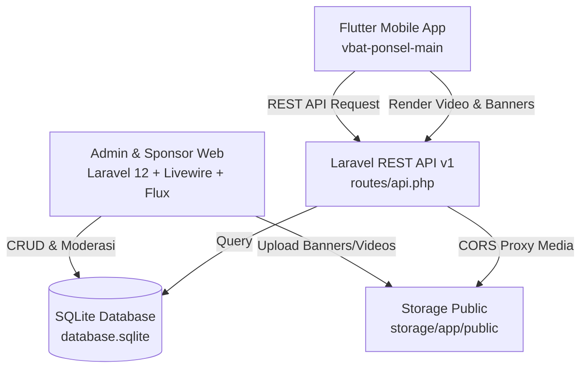

# 📱 VBAT Ecosystem — Project Overview & Developer Guide
> **Dokumen Panduan Teknis & Status Pengembangan untuk Developer / AI Agent**  
> *Mencakup arsitektur, database, API, serta fitur yang sudah dan belum selesai untuk Web Admin (`VBAT-WEB`) dan Mobile App (`vbat-ponsel-main`).*

---

## 📌 1. Ringkasan Ekosistem (Executive Summary)

Proyek **VBAT** adalah platform edukasi teknisi ponsel (LMS) terintegrasi dengan e-commerce sponsor, hardware solution, dan sistem keanggotaan teknisi di bawah naungan **Quantum Tele**. Ekosistem ini terdiri dari 2 repositori utama:

1. **`VBAT-WEB` (Backend & Web Portal)**:
   - **Framework**: Laravel 12 (PHP 8.2+)
   - **Fullstack UI**: Laravel Livewire 4 + Flux UI
   - **Database**: SQLite (`database/database.sqlite`) / MySQL Ready
   - **Peran**: REST API Server untuk mobile app, Admin CMS (Moderasi Sponsor, Kelas/LMS, Event Diskon, Push Notifikasi), dan Portal Khusus Entitas Sponsor (Upload materi promosi).
2. **`vbat-ponsel-main` (Aplikasi Mobile)**:
   - **Framework**: Flutter 3.x (Dart)
   - **Arsitektur**: Clean Architecture (Data, Domain, Presentation)
   - **Platform Target**: Android & iOS (Native), Chrome Web (Preview/Testing)
   - **Peran**: Client app untuk murid teknisi, katalog produk sponsor, streaming materi video edukasi, dan konsultasi teknisi.

---

## 🏗️ 2. Arsitektur & Tech Stack



| Komponen | Web Admin (`VBAT-WEB`) | Mobile App (`vbat-ponsel-main`) |
|---|---|---|
| **Framework / Engine** | Laravel 12.x | Flutter 3.x |
| **State / UI Lib** | Livewire 4 + Flux UI | Stateful/Stateless + GoRouter |
| **Database / Storage** | SQLite (`database.sqlite`) | SharedPreferences & SQLite Local |
| **Networking** | Guzzle / Http Client | Dio HTTP Client |
| **Video Player** | HTML5 Native `<video>` tag | `video_player` + `chewie` |
| **Upload Config** | `upload_max_filesize = 64M`, Livewire max 20MB | Multi-part Form Data |

---

## 🗄️ 3. Struktur Database (Schema & Relationships)

Database utama terletak di `VBAT-WEB/database/database.sqlite`. Berikut daftar tabel dan relasinya:

### 3.1. Tabel Autentikasi & Pengguna (`users`)
- `id` (BIGINT, PK)
- `name` (VARCHAR)
- `email` (VARCHAR, Unique)
- `role` (VARCHAR: `'super_admin'`, `'owner'`, `'sponsor'`, `'student'`)
- `birth_date` (DATE, Nullable)
- `gender` (VARCHAR: `'male'`, `'female'`, `'other'`, Nullable)
- `province_id` (FK -> `provinces.id`, Nullable)
- `city_id` (FK -> `cities.id`, Nullable)
- `phone` (VARCHAR, Nullable)
- `whatsapp` (VARCHAR, Nullable)
- `address` (TEXT, Nullable)
- `profile_completed` (BOOLEAN, Default: `false`)

### 3.2. Wilayah / Demografi (`provinces` & `cities`)
- **`provinces`**: `id`, `name`, `timestamps`
- **`cities`**: `id`, `province_id` (FK -> `provinces.id`), `name`, `type` (Kota/Kabupaten), `postal_code`, `timestamps`

### 3.3. Sponsor & Produk (`sponsors` & `sponsor_products`)
- **`sponsors`**:
  - `id` (BIGINT, PK)
  - `user_id` (FK -> `users.id`, Nullable) — Akun login sponsor
  - `name`, `slug` (Unique), `description`, `logo_path`, `website_url`
  - `tier` (VARCHAR: `'platinum'`, `'gold'`, `'silver'`, `'partner'`)
  - `weight` (INT, Default 0) — Bobot prioritas penayangan
  - `start_date`, `end_date`, `is_active` (BOOLEAN)
  - `contact_email`, `phone`, `whatsapp`, `address`, `province_id`, `city_id`
- **`sponsor_products`**:
  - `id` (BIGINT, PK)
  - `sponsor_id` (FK -> `sponsors.id`, Cascade)
  - `name`, `slug`, `description`
  - `price` (DECIMAL 15,2), `discount_price` (DECIMAL 15,2, Nullable)
  - `image_path` (VARCHAR)
  - `shopee_url` (TEXT), `tokopedia_url` (TEXT)
  - `is_featured` (BOOLEAN), `is_active` (BOOLEAN), `order` (INT)
  - `view_count` (UINT), `click_count` (UINT)

### 3.4. Kampanye Iklan & Tracking (`campaigns`, `campaign_logs`, `user_wishlists`)
- **`campaigns`**:
  - `id` (BIGINT, PK)
  - `sponsor_id` (FK -> `sponsors.id`, Cascade)
  - `title` (VARCHAR)
  - `placement_type` (`'hero_slider'`, `'shop_horizontal'`, `'best_deal'`)
  - `media_path` (VARCHAR) — Path file di storage
  - `media_type` (`'image'`, `'video'`)
  - `target_url` (TEXT) — URL tujuan saat di-klik
  - `description` (TEXT)
  - `daily_limit` (UINT, Default 1000) — Batas kuota tayang harian
  - `weight` (INT, Default 1) — Bobot rotasi penayangan
  - `start_date`, `end_date` (DATE)
  - `status` (`'pending'`, `'approved'`, `'rejected'`)
  - `rejection_reason` (TEXT, Nullable)
- **`campaign_logs`**:
  - `id`, `campaign_id` (FK), `sponsor_product_id` (FK), `user_id` (FK)
  - `event_type` (`'view'`, `'click'`, `'wishlist'`)
  - `ip_address`, `user_agent`, `created_at`
- **`user_wishlists`**:
  - `id`, `user_id` (FK), `sponsor_product_id` (FK), `timestamps` (Unique `user_id + sponsor_product_id`)

### 3.5. Event Diskon Global (`discount_events`)
- `id` (BIGINT, PK)
- `name` (VARCHAR)
- `discount_type` (`'percentage'` / `'fixed_nominal'`)
- `discount_value` (DECIMAL 15,2)
- `banner_text` (VARCHAR)
- `start_at`, `end_at` (DATETIME)
- `is_active` (BOOLEAN)

### 3.6. Push Notifikasi (`push_notifications`)
- `id`, `title`, `message`, `deep_link`, `image_url`
- `target_audience` (`'all'`, `'android'`, `'iphone'`, `'premium'`)
- `scheduled_at`, `sent_at`, `status` (`'draft'`, `'scheduled'`, `'sent'`, `'failed'`)
- `success_count`, `failure_count`

### 3.7. Kursus & Materi Pembelajaran (`courses`, `lessons`, `videos`)
- **`courses`**: `id`, `title`, `slug`, `description`, `thumbnail_path`, `status` (`'draft'`, `'published'`), `is_featured`
- **`lessons`**: `id`, `course_id` (FK), `title`, `sort_order`
- **`videos`**: `id`, `course_id` (FK), `lesson_id` (FK), `title`, `description`, `source_type` (`'youtube'`, `'upload'`), `source_path`, `duration_seconds`, `sort_order`

---

## 📡 4. Daftar API Penting (REST Endpoints)

Base URL: `http://127.0.0.1:8000/api/v1` (atau IP lokal host saat testing di perangkat fisik / emulator Android: `http://10.0.2.2:8000/api/v1`).

### 4.1. Banners & Promosi Sponsor
| Endpoint | Method | Deskripsi | Parameter / Response Contoh |
|---|---|---|---|
| `/banners/hero` | `GET` | Mengambil banner hero slider beranda (maks 6 slide, status `approved`, aktif hari ini). Diurutkan berdasarkan `weight DESC`. | **Response 200 OK**:<br/>`{"success": true, "data": [{"id": 1, "title": "...", "media_url": "...", "media_type": "video", "target_url": "...", "description": "...", "sponsor_name": "..."}]}` |
| `/banners/shop-horizontal` | `GET` | Mengambil banner horizontal sponsor untuk disisipkan di antara katalog produk toko (kelipatan 12). | **Response 200 OK**:<br/>`{"success": true, "data": [{"id": 2, "media_url": "...", "media_type": "image", "target_url": "..."}]}` |
| `/shop/best-deals` | `GET` | Mengambil katalog produk sponsor unggulan (*Best Deals*). Otomatis menghitung diskon jika ada event aktif. | **Response 200 OK**:<br/>`{"success": true, "data": [{"id": 5, "name": "...", "price": 500000, "final_price": 450000, "image_url": "...", "shopee_url": "...", "tokopedia_url": "..."}]}` |

### 4.2. Event Diskon Dinamis
| Endpoint | Method | Deskripsi | Parameter / Response Contoh |
|---|---|---|---|
| `/shop/events/active` | `GET` | Cek apakah saat ini ada event flash sale / diskon global yang sedang berjalan. | **Response 200 OK**:<br/>`{"success": true, "data": {"id": 1, "name": "Promo Ramadhan", "discount_type": "percentage", "discount_value": 10, "banner_text": "Diskon 10% Semua Produk"}}` |

### 4.3. Tracking & Interaksi
| Endpoint | Method | Deskripsi | Payload (JSON) |
|---|---|---|---|
| `/track` | `POST` | Mencatat log tayang/klik iklan atau produk | `{"campaign_id": 1, "sponsor_product_id": null, "event_type": "click"}` |
| `/wishlist/toggle` | `POST` | Tambah / hapus produk dari wishlist pengguna | `{"sponsor_product_id": 5, "user_id": 1}` |

### 4.4. Demografi & Wilayah
| Endpoint | Method | Deskripsi |
|---|---|---|
| `/regions/provinces` | `GET` | Daftar semua provinsi di Indonesia |
| `/regions/cities/{provinceId}` | `GET` | Daftar kota/kabupaten berdasarkan `provinceId` |
| `/user/demographics` | `POST` | Simpan data diri lengkap teknisi untuk kebutuhan sertifikat digital |

### 4.5. Broadcast Notifikasi
| Endpoint | Method | Deskripsi |
|---|---|---|
| `/notifications` | `GET` | Feed notifikasi pengumuman dari admin |

### 4.6. CORS Media Proxy Route
| Endpoint | Method | Deskripsi |
|---|---|---|
| `/storage/{path}` | `GET` | Proxy khusus untuk melayani file gambar & video dengan header `Access-Control-Allow-Origin: *`. Sangat krusial agar video & gambar dapat dirender tanpa terhalang CORS di Flutter Web (CanvasKit) maupun Mobile. |

---

## 📊 5. Status Progres Proyek (Sudah vs Belum)

Berdasarkan dokumen spesifikasi final (`final_requirements_vbatponsel.md`), berikut adalah rincian progres per bagian:

### ✅ A. SUDAH SELESAI (Completed)

#### 1. Web Admin & Portal Sponsor (`VBAT-WEB`):
- [x] **Panel Sponsor Terpisah**: Sponsor dapat login mandiri untuk mengunggah materi promosi (gambar & video).
- [x] **Formulir Pengajuan Kampanye Video/Gambar**:
  - Mendukung file gambar (`.jpg, .png, .webp`) dan file video (`.mp4, .mov`).
  - Dilengkapi perhitungan ukuran file real-time (tampil ukuran file dan batas maksimum 20MB).
  - Preview interaktif langsung di browser (HTML5 `<video>` player dengan badge 🎥 VIDEO).
- [x] **Moderasi Kampanye oleh Admin**:
  - Halaman peninjauan kampanye sponsor: status Pending, Approved, Rejected (dengan alasan penolakan).
  - Pengaturan limit tayang harian (`daily_limit`) dan frekuensi bobot rotasi tayang (`weight`).
- [x] **Manajemen Produk Sponsor (Katalog & Best Deals)**:
  - Input nama produk, foto, harga asli, harga diskon, link Shopee, dan link Tokopedia.
- [x] **Event Diskon Global / Flash Sale**:
  - Fitur pengaktifan event diskon berkala (persentase atau nominal tetap) yang otomatis menghitung harga coret di API.
- [x] **Infrastruktur Upload & CORS Media Proxy**:
  - Konfigurasi batas upload PHP (`upload_max_filesize = 64M`, `post_max_size = 64M`, Livewire rule max 20MB).
  - Endpoint proxy `/api/v1/storage/{path}` dengan full CORS support.

#### 2. Mobile App (`vbat-ponsel-main`):
- [x] **Hero Slider Beranda Interaktif**:
  - Menampilkan maksimal 6 banner promosi sponsor teratas.
  - **Mendukung Pemutaran Video**: Dilengkapi komponen `VideoPreviewWidget` yang otomatis memutar video (muted/autoplay), responsif gestur tap, dan dilengkapi badge label `🎥 VIDEO PROMO`.
  - Jika diklik, memunculkan modal detail sponsor dan tombol direct link.
- [x] **Katalog Shop & Best Deals**:
  - Menampilkan daftar produk sponsor terintegrasi langsung dengan API backend.
  - Tombol aksi mengarahkan pengguna ke aplikasi Shopee atau Tokopedia.
  - Banner horizontal sponsor otomatis tersisip setiap kelipatan 12 produk (mendukung gambar maupun video).
- [x] **Pencarian Global (Global Search)**:
  - Pencarian live yang mencari secara langsung produk di API `/shop/best-deals` dan modul kursus.
  - UI responsif dengan badge harga dan status ketersediaan.
- [x] **Pull-to-Refresh**:
  - Halaman Beranda (`home_page.dart`) dan Halaman Toko (`shop_page.dart`) mendukung *swipe down to refresh* untuk menyinkronkan data terbaru dari server.

---

### ⏳ B. BELUM SELESAI / ROADMAP LANJUTAN (Pending & Backlog)

Mengacu pada `final_requirements_vbatponsel.md`, modul-modul berikut merupakan tahap berikutnya:

#### 1. Autentikasi & Sertifikat Digital (Section 1 Final Req):
- [ ] **Social Login**: Login menggunakan Google OAuth, Apple ID, dan Facebook/WhatsApp.
- [ ] **Validasi Kelengkapan Profil**: Dialog/peringatan di profil bahwa nama dan NIK/data diri yang diisi permanen untuk sertifikat.
- [ ] **KTA Digital (Kartu Tanda Anggota)**: Generate otomatis kartu keanggotaan digital teknisi saat membeli kelas (berlaku selamanya).
- [ ] **Verifiable Digital Badges (Sertifikat Non-Blockchain)**: Sistem sertifikat digital dengan URL verifikasi unik (gaya Skilvul/Parchment).

#### 2. Hak Akses Kursus & Pembatasan Video (Section 2 Final Req):
- [ ] **Akses Kelas Sesuai Tier**: Pemisahan hak akses antara Kelas Android (Rp 800k), Kelas iPhone (Rp 2jt), dan Bundling (Rp 2.5jt).
- [ ] **Pembatasan Preview Video (5-10 Detik)**: Pengguna gratis hanya dapat menonton 5-10 detik pertama dari materi berbayar sebelum diminta berlangganan/beli.
- [ ] **Gating Hardware Solution (HS)**: Fitur HS terkunci secara mutlak dan hanya terbuka otomatis setelah murid menyelesaikan 100% video dan kuis kelas bersangkutan.
- [ ] **Constraint Video Player (No Skip / Fast-Forward)**: Menghapus tombol *forward* atau *seek bar* pada video materi agar murid wajib menonton secara tuntas.
- [ ] **Mode Offline Terenkripsi**: Download materi kelas ke penyimpanan lokal dalam format terenkripsi (mencegah pembajakan/ekstraksi file video).
- [ ] **Kuis & Evaluator Kata Kunci**: Kuis 3 tipe (Pilihan Ganda, Jawaban Singkat, Kasus) dengan algoritma keyword matching otomatis.

#### 3. Keamanan OS (Section 4 Final Req):
- [ ] **Super Secret Mode**: Proteksi native OS (`FLAG_SECURE` di Android, pelindung screen-recording di iOS) pada layar materi eksklusif.

#### 4. Gamifikasi, Onboarding & Support (Section 5 Final Req):
- [ ] **Onboarding Tour App**: Panduan pengenalan fitur saat aplikasi pertama kali dibuka oleh pengguna baru.
- [ ] **Gamifikasi**: Sistem lencana (*badges/achievements*) dan pelacak keaktifan harian (*daily streak*).
- [ ] **Modul E-Book**: Penempatan viewer file PDF/E-Book di halaman Belajar & Profil.
- [ ] **Menu Informasi (Pengganti Forum)**: Broadcast pengumuman 1 arah dari admin (Lowongan, Magang, Konsultasi).
- [ ] **Akses WhatsApp VIP Pak Tomi**: Tombol chat bantuan WhatsApp langsung ke Pak Tomi yang **hanya muncul** jika akun murid berstatus pelanggan premium aktif.

---

## 🚀 6. Cara Menjalankan & Menguji Proyek

### 6.1. Menjalankan Backend (`VBAT-WEB`)
Pastikan PHP 8.2+ dan Composer sudah terpasang.

```bash
cd "VBAT-WEB"

# Install dependensi jika baru clone
composer install
npm install

# Jalankan migrasi dan seeder
php artisan migrate
php artisan db:seed

# Buat symbolic link storage
php artisan storage:link

# Jalankan server lokal
php artisan serve --host=127.0.0.1 --port=8000
```

> **Catatan Upload Video**: File `php.ini` lokal harus memiliki:
> ```ini
> upload_max_filesize = 64M
> post_max_size = 64M
> memory_limit = 256M
> ```

### 6.2. Menjalankan Mobile App (`vbat-ponsel-main`)
Pastikan Flutter SDK sudah terpasang dan terdeteksi dengan baik (`flutter doctor`).

```bash
cd "vbat-ponsel-main"

# Unduh packages
flutter pub get

# Jalankan di Chrome (Web Testing)
flutter run -d chrome

# Atau jalankan di Simulator iOS / Emulator Android
flutter run
```

---

## 🧑‍💻 7. Catatan Penting untuk AI Agent / Developer Penerus

1. **URL Basis API**:
   - Kode koneksi HTTP di Flutter berada di `lib/core/network/` atau `lib/core/constants/`.
   - Default URL diatur ke `http://127.0.0.1:8000/api/v1` untuk Chrome Web.
   - Jika berpindah ke Emulator Android, ubah host ke `http://10.0.2.2:8000/api/v1`.
2. **CORS & Asset Storage**:
   - Gambar atau video yang diunggah sponsor disimpan di `storage/app/public/...`.
   - Di Flutter Web, mengakses langsung `http://127.0.0.1:8000/storage/...` akan memicu error CORS CanvasKit.
   - **Gunakan selalu proxy route**: `http://127.0.0.1:8000/api/v1/storage/{path}` yang sudah menyertakan header `Access-Control-Allow-Origin: *`.
3. **Komponen Video di Flutter**:
   - Komponen pemutar video promosi berulang tanpa suara (*muted autoplay*) diimplementasikan di:
     `lib/core/widgets/video_preview_widget.dart`
   - Sudah dibungkus dengan `IgnorePointer` di dalam `VideoPlayer` agar sentuhan (*tap*) pada banner tetap ditangkap oleh `GestureDetector` pembungkusnya untuk membuka tautan promosi.
4. **Alur Moderasi Sponsor**:
   - Akses URL Admin: `http://127.0.0.1:8000/admin/campaigns`
   - Akses Portal Sponsor: `http://127.0.0.1:8000/sponsor/campaigns`
   - Kampanye yang baru diajukan berstatus `pending` dan **tidak akan muncul di aplikasi mobile** sampai disetujui (`approved`) oleh Admin di panel moderasi.

---
*Dokumen ini diperbarui secara otomatis dan menjadi acuan standar implementasi tim developer VBAT & Quantum Tele.*
